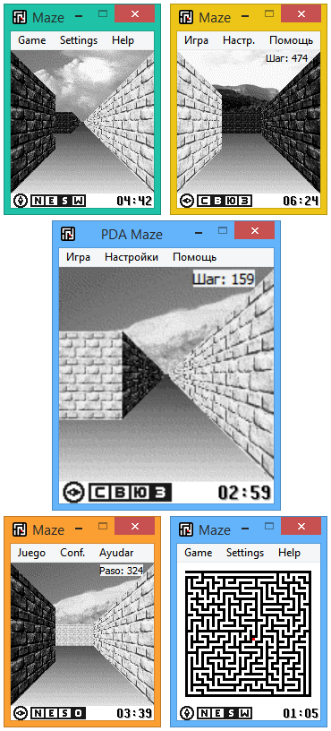

# PDA Maze Qt_WebAssembly
=============

PDA Maze is rewrite Bill Kendrick's and Robert Ernst maze game to modern Qt library (4.x.x, 5.x.x versions).

Added:

1. New Compass Indicator;

2. Step Indicator;

3. Screen scale function with smoothing;

4. Translated into English, Russian and Spanish.

Fixed many graphical glitches.

## Screens:

## References
https://github.com/EXL/PDA_Maze (Source and Author)
